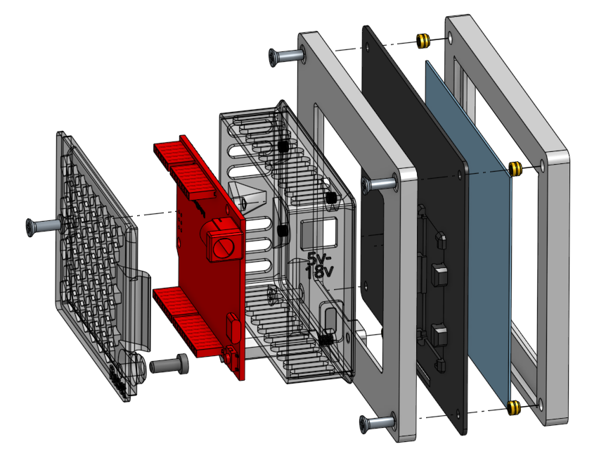
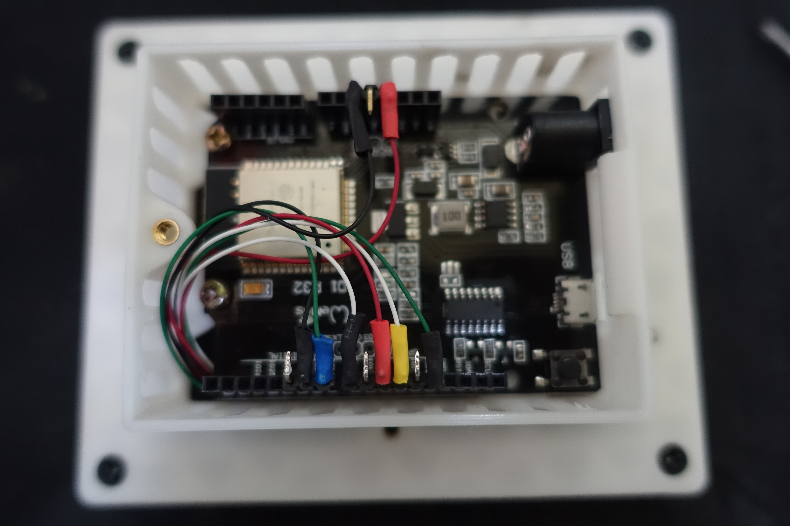
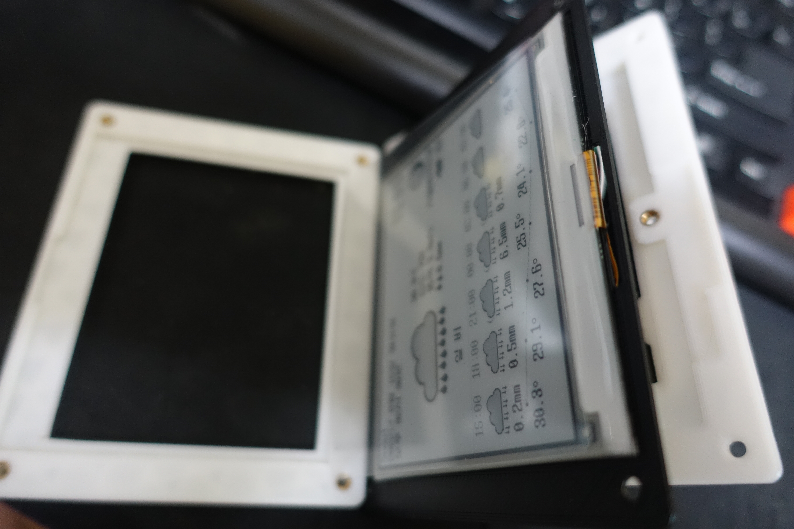
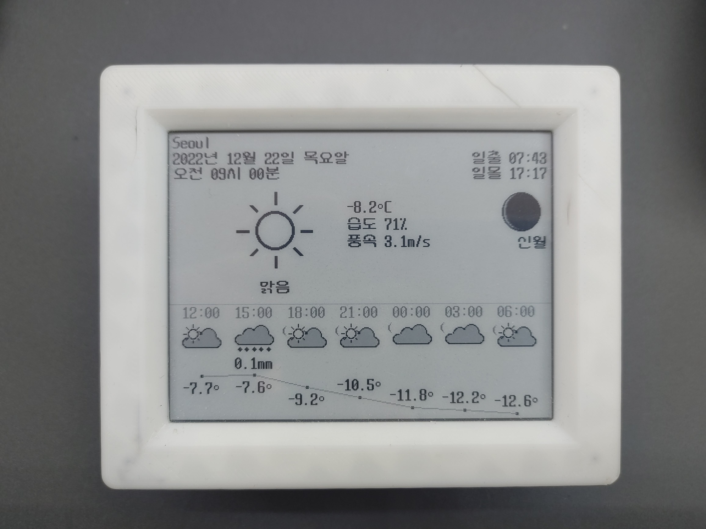

## this is 3d cad, step file.

주의점
1. cage와 back은 접착제로 고정

추후개선
1. mid의 epaper driver 고정대의 위치는 약간 조정해야 함. 설치에 문제는 없지만, 리본케이블이 약간 비틀림
2. cage는 esp32보드의 실제 형상에 맞게 수정해야 함. 
 - 나사구멍, usb 포트, 전원 커넥터의 위치
3. cage cover가 cage에 결합이 깔끔하지 않음 공차를 더 줘야 할듯?
